Webhooks Core — Developer Guide
================================

This guide covers the core data model, handler execution contract, and service
layer. It is the foundation for understanding both the inbound and outbound
gateway addons.

Data Model
----------

The core addon defines one primary model:

- ``bwt.webhook.handler`` — execution definition shared by both gateway addons.
  Carries direction, execution mode, and optional Python callback pointers.

The gateway addons extend the graph with these models:

- ``bwt.webhook.inbound.endpoint`` — public HTTP receiver (inbound addon).
- ``bwt.webhook.inbound.event`` — audit record for each received request.
- ``bwt.webhook.inbound.handler.rule`` — declarative rule row on a handler.
- ``bwt.webhook.outbound.endpoint`` — target HTTP configuration (outbound addon).
- ``bwt.webhook.outbound.delivery`` — queued outbound request snapshot.
- ``bwt.webhook.outbound.delivery.attempt`` — per-attempt HTTP execution log.

Handler Execution Modes
------------------------

Model Driven
~~~~~~~~~~~~

Rules on the handler are evaluated in ascending ``sequence`` order. Each rule
carries:

- **Conditions** — zero or more field-path comparisons against the event or
  delivery payload; all conditions must pass for the rule to fire.
- **Action** — one of ``done``, ``dead_letter``, ``retry``, ``create_record``,
  ``update_record``, ``upsert_record``.
- **Assignments** — field path → value mappings written to the target record on
  create/update/upsert actions.
- **Lookup Keys** — field path → value mappings that locate the existing record
  for ``update_record`` and ``upsert_record``.

The first matching rule wins. If no rule matches, the event or delivery is
marked ``done`` by default.

Python Callback
~~~~~~~~~~~~~~~

Inbound callback signature::

    def handle_inbound_event(self, event):
        payload = event.get_payload()
        # ... your logic ...
        return event.webhook_done()

Outbound callback signature::

    def handle_outbound_delivery(self, delivery):
        # ... your logic ...
        return delivery._build_outbound_delivery_result(outcome="send")

Returning ``None`` from either callback produces a framework-level
``dead_letter``. Use the helper methods on the event or delivery record to
return well-formed results: ``webhook_done()``, ``webhook_dead_letter()``,
``webhook_retry(seconds=N)``.

Service Layer
-------------

``bwt_webhooks_core`` ships pure-Python service modules that the ORM models
delegate to. These can be imported and tested without the ORM:

- ``services/signature.py`` — HMAC computation and constant-time verification.
  Algorithms: ``sha1``, ``sha256``, ``sha512``. Encodings: ``hex``, ``base64``.
- ``services/transport.py`` — translates ``OutboundRequest`` value objects to
  ``requests.request`` kwargs. Handles ``json``, ``form_urlencoded``, and
  ``multipart`` body modes.
- ``services/identity.py`` — delivery identity and replay identity resolution,
  keyed by a configurable header or payload path.
- ``services/conditions.py`` — condition evaluation engine used by model-driven
  rule processing.
- ``services/value_objects.py`` — ``InboundMetadata``, ``OutboundRequest``, and
  ``HandlerOutcome`` data classes that keep the processing pipeline explicit.

Exceptions
~~~~~~~~~~

All framework exceptions live in ``bwt_webhooks_core.exceptions``:

- ``WebhookValidationError`` — base class.
- ``WebhookSignatureValidationError`` — HMAC mismatch.
- ``WebhookFreshnessValidationError`` — timestamp outside the allowed window.
- ``WebhookPayloadValidationError`` — unexpected payload shape.
- ``WebhookProcessingConfigurationError`` — misconfigured handler or endpoint.

Extending the Framework
------------------------

To add a custom processing step:

1. Create a model with a method matching the callback contract above.
2. Create a ``bwt.webhook.handler`` record pointing to that model and method
   via **Webhooks → Handlers**.
3. Attach the handler to an inbound endpoint or outbound endpoint record.

To expose a new value in model-driven rule assignments, extend
``bwt.webhook.inbound.event`` or ``bwt.webhook.outbound.delivery`` with a
stored field and make it accessible via the value-extraction path used in
assignments.

No core file edits are required; the framework is designed to be extended
through standard Odoo model inheritance and configuration records.
