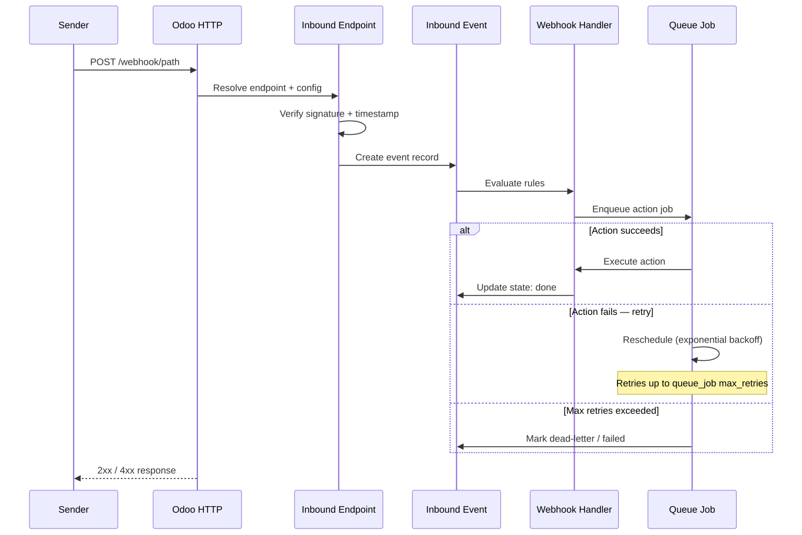

Webhooks Inbound — Developer Guide
====================================

This guide covers the inbound processing pipeline, model-driven rule contract,
and extension points for developers building on or customising the inbound
gateway addon.

Inbound Processing Lifecycle
------------------------------

When a request arrives at an inbound endpoint the pipeline is:

1. **HTTP reception** — the controller writes a ``bwt.webhook.inbound.event``
   record in state ``received`` and enqueues a background job.
2. **Signature verification** (if enabled) — HMAC of the configured message
   parts is compared against the request signature header using constant-time
   comparison. Failure moves the event to state ``rejected``.
3. **Freshness check** (if enabled) — the timestamp header is parsed and
   validated against the configured age and skew bounds. Failure → ``rejected``.
4. **Delivery identity** — a delivery identity key is resolved and checked
   for duplicates. A duplicate request updates the existing event record; the
   new request body is not processed again.
5. **Handler dispatch** — the event's handler is called (model-driven rules or
   Python callback). The return value determines the final state.

Event State Machine
--------------------

Valid state transitions:

- ``received`` → ``processing`` → ``done``
- ``received`` → ``processing`` → ``error``
- ``received`` → ``processing`` → ``dead_letter``
- ``received`` → ``rejected`` (signature or freshness failure; not retryable)

Operators can reset ``error`` and ``dead_letter`` events back to ``received``
for reprocessing. ``rejected`` events are closed and require a new inbound
request.

Model-Driven Rule Processing
------------------------------

Rules are rows on ``bwt.webhook.inbound.handler.rule``, evaluated in
ascending ``sequence`` order. Each rule exposes:

- ``condition_ids`` (``bwt.webhook.inbound.handler.rule.condition``) — each
  condition specifies a field path into the event payload, an operator
  (``=``, ``!=``, ``in``, ``not in``, ``contains``, ...), and a literal value.
- ``action_type`` — one of:

  - ``done`` — mark the event done; stop rule evaluation.
  - ``dead_letter`` — move to dead-letter; stop evaluation.
  - ``retry`` — re-enqueue after ``retry_seconds``; stop evaluation.
  - ``create_record`` — create a new record on ``target_model_name``.
  - ``update_record`` — update an existing record located via ``lookup_ids``.
  - ``upsert_record`` — create or update; locate via ``lookup_ids``.

- ``assignment_ids`` (``bwt.webhook.inbound.handler.rule.assignment``) — each
  assignment maps a target field name to a value source: ``resolved_value``
  (extracted from the event payload path), ``semantic_field`` (a named
  semantic binding), ``event_field`` (a field on the event record itself), or
  ``literal`` (a hardcoded string or number).

Value Extraction
-----------------

The framework extracts values from event payloads using dot-separated paths
(e.g. ``data.object.id``). Path resolution is handled by
``services/value_extraction.py``:

- ``walk_payload_path(payload, path)`` — navigate nested dicts and lists.
- ``extract_header(headers, name)`` — case-insensitive header lookup.
- ``extract_header_parameters(value)`` — parse ``key=value`` pairs from header
  parameter strings (e.g. ``Content-Type: application/json; charset=utf-8``).

These helpers are available for use in custom Python callbacks.

Semantic Bindings
------------------

Semantic bindings (``bwt.webhook.inbound.endpoint.semantic.binding``) allow
endpoints to map named semantic names (e.g. ``company_id``, ``partner_id``)
to resolved values extracted from the request. Assignments can then reference
these by semantic name, keeping rule configuration decoupled from specific
payload paths.

Extending Inbound Processing
------------------------------

To add a computed field available as an assignment source:

1. Extend ``bwt.webhook.inbound.event`` with a new stored computed field.
2. Add a source kind entry pointing to the new field.
3. Reference the field name in model-driven rule assignments via the
   ``event_field`` source kind.

To add a new action type, extend ``bwt.webhook.inbound.handler.rule`` and
override ``_execute_model_driven_handler`` on the event model to dispatch the
new type.

No core file edits are required; all extension points use standard Odoo
model inheritance.
