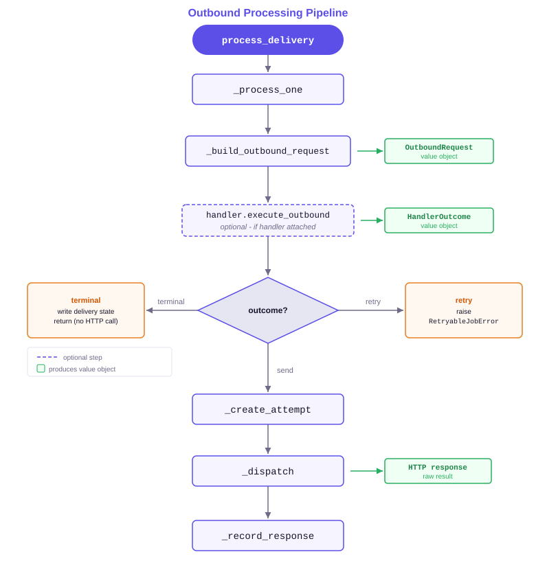

Webhooks Outbound — Developer Guide
=====================================

This guide covers the outbound delivery pipeline, handler and rule contract,
and extension points for developers building on or customising the outbound
delivery addon.

Outbound Processing Pipeline
-----------------------------

The diagram below shows the call chain executed for every delivery record.

Two value objects keep the data flow explicit:

- ``OutboundRequest`` — immutable snapshot of the HTTP request to send
  (method, URL, headers, body mode, payload).
- ``HandlerOutcome`` — interpretation of the handler's return value:
  ``send``, ``retry``, ``done``, ``dead_letter``, or ``cancel``.

Delivery State Machine
-----------------------

States and valid operator-driven transitions:

- ``draft`` → ``queued`` (via queue action or programmatic call)
- ``queued`` → ``processing`` (worker picks up the job)
- ``processing`` → ``done`` (HTTP success)
- ``processing`` → ``error`` (exception or HTTP error response)
- ``processing`` → ``dead_letter`` (handler dead-letters)
- ``processing`` → ``canceled`` (handler cancels)
- ``error`` / ``dead_letter`` / ``canceled`` → ``draft`` (operator reset)

Model-Driven Rule Processing
------------------------------

Rules on ``bwt.webhook.outbound.handler.rule`` are evaluated before the HTTP
request is dispatched. Supported actions:

- ``send`` — allow the delivery to proceed (default when no rule matches).
- ``done`` — mark delivery done without sending.
- ``dead_letter`` — dead-letter the delivery without sending.
- ``retry`` — re-enqueue after ``retry_seconds``.
- ``mutate`` — modify the ``OutboundRequest`` payload or headers via
  assignments before sending.

Conditions use the same field-path and operator syntax as inbound rules,
evaluated against the delivery's resolved context and endpoint configuration.

Context Lines
--------------

Context lines (``bwt.webhook.outbound.delivery.context_line``) are key/value
pairs attached to a delivery at queue time. They serve three purposes:

- Resolve ``{token}`` placeholders in the endpoint **Target Path**.
- Supply values referenced in header and payload rules.
- Pass business identifiers to the backend's ``_get_outbound_extra_headers``
  hook (see the Connector Integration guide).

Attach context lines when queueing a delivery programmatically::

    endpoint = self.env["bwt.webhook.outbound.endpoint"].search(
        [("code", "=", "my-endpoint")]
    )
    delivery = endpoint.queue_delivery(
        payload={"event": "order.paid", "order_id": order.id},
        context_lines={"order_id": str(order.id)},
    )

Transport Layer
----------------

The service module ``services/transport.py`` translates an ``OutboundRequest``
into ``requests.request`` kwargs:

- ``build_transport_kwargs(request)`` — returns a dict ready for
  ``requests.request(**kwargs)``.
- ``flatten_form_data(values)`` — flattens nested dicts for
  ``application/x-www-form-urlencoded`` encoding using ``key[child]`` notation.
- ``normalize_request_files(files)`` — coerces file mappings into the tuples
  that ``requests`` expects for ``multipart/form-data``.

These helpers can be imported and unit-tested without the ORM.

Extending Outbound Processing
------------------------------

To add dynamic headers (e.g. per-delivery authentication or versioning):

1. Use the connector backend hook ``_get_outbound_extra_headers(delivery)``
   (see the Connector Integration guide) when the extra headers come from a
   connector backend.
2. For non-connector use cases, extend ``bwt.webhook.outbound.delivery`` and
   override ``_collect_extra_headers`` to contribute additional headers.

Headers returned by backend hooks are merged on top of endpoint header rules,
so backend-level authentication always takes precedence.

To add a custom pre-dispatch check, extend
``bwt.webhook.outbound.delivery`` and override ``_pre_dispatch_check``,
returning a result dict to short-circuit or ``None`` to allow dispatch.
